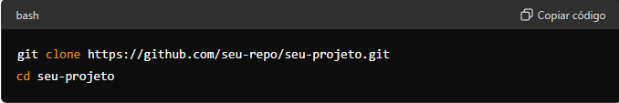
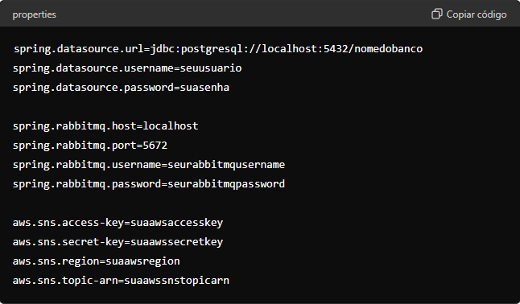

# Tracker_Logistcs 
 Projeto Spring Boot com PostgreSQL, JPA, RabbitMQ e Amazon SNS
## Visão Geral do Projeto

Este projeto é uma aplicação Spring Boot que utiliza PostgreSQL, JPA, RabbitMQ e Amazon SNS. A aplicação permite criar produtos, criar contas de usuário e listar todos os produtos associados a um usuário. Além disso, sempre que o status de um produto é atualizado, uma mensagem é enviada para uma fila RabbitMQ e uma notificação SMS é enviada para o telefone do usuário via Amazon 

## Tecnologias Utilizadas

- Spring Boot

- PostgreSQL

- JPA (Java Persistence API)

- RabbitMQ

- Amazon SNS
  
## Configuração do Projeto

## Pré-requisitos : 

- Java 11 ou superior

- PostgreSQL

- RabbitMQ
  
- Conta AWS com o serviço SNS habilitado

## Instalação

- Clone o repositório

- Atualize as propriedades da aplicação

## Endpoints

- Criar Usuário

URL: create/users

Método: POST

- Criar Produto

URL: create/product

Método: POST

- Listar Produtos por usuario

URL: /user/{id}/products

Método: GET

- Atualizar Produtos

URL: product/actualize/{id}

Método: PUT

## Contribuição

Se você quiser contribuir para este projeto, sinta-se à vontade para fazer um fork do repositório e enviar pull requests. Todas as contribuições são bem-vindas!

